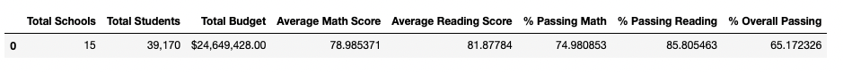
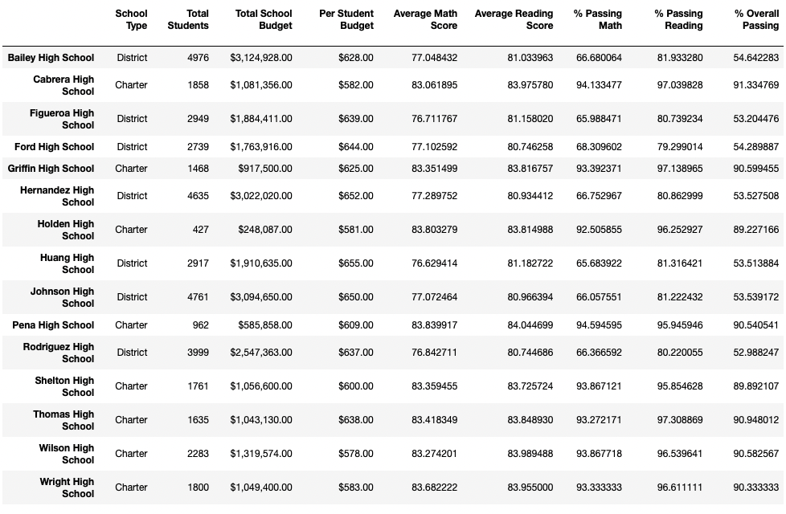
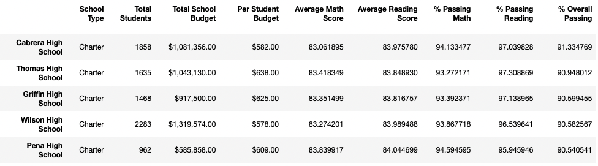
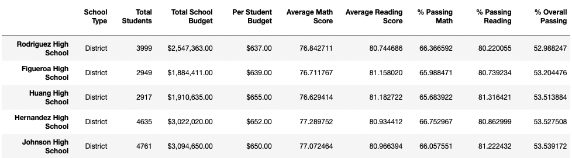
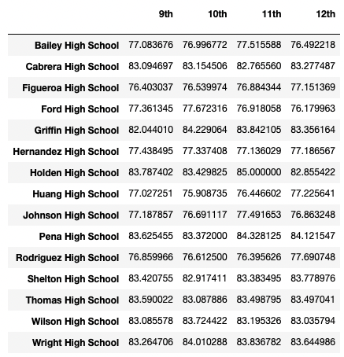
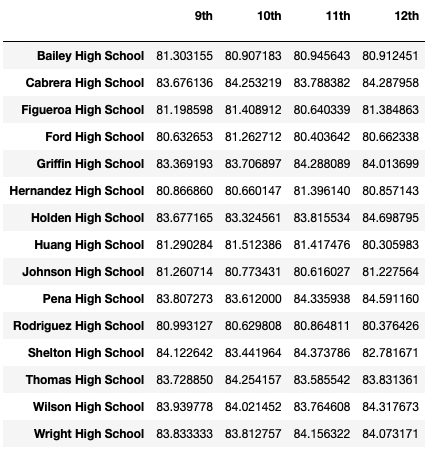
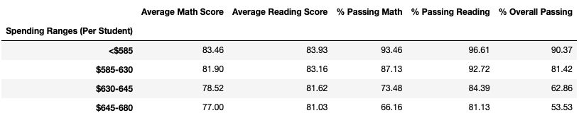
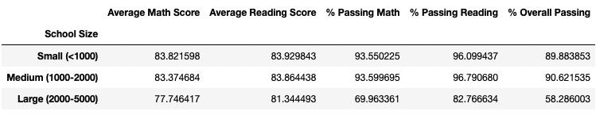
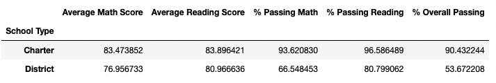

# School Data Analysis

Author: Rosie Gianan, gianr00@gmail.com

Build with: Pandas and Jupyter Notebook

## Objective:
Analyze the district-wide standardized test results data saved in 
[schools data csv]( PyCitySchools/Resources/schools_complete.csv) file and 
[students data csv]( PyCitySchools/Resources/students_complete.csv) file. Create the summary reports to help the school board and mayor make strategic decisions regarding future school budgets and priorities.

## Solution:
Using Pandas and Jupyter notebook , analyze the district-wide standardized test result data and create the following summary reports reflecting the Average, % Percent passing and % Overall Passing:
-    District Summary
-    School Summary
-    Highest-Performing Schools (by % Overall Passing)
-    Lowest-Performing Schools (by % Overall Passing)
-    Math Scores by Grade
-    Reading Scores by Grade
-    Scores by School Spending
-    Scores by School Size
-    Scores by School Type

#### District Summary:
-    The average math and average reading scores are relatively close
-    The percent passing reading tells there are more students who passed reading compared to math

 

#### School Summary:
-    Reading has higher passed average compare to math
-    The district schools are bigger in sizes

 

#### Highest-Performing Schools (by % Overall Passing):
-    The top performing schools are Charter schools
-    Smaller size schools are the high performing schools

 

#### Lowest-Performing Schools (by % Overall Passing):
-    Bottom performing schools are District schools 
-    Biggest size schools are the bottom performing schools

 

#### Math Scores by Grade:
-    Most schools don’t maintain an increasing average from 9th to 12 grades
-    Most schools decreased the average between 9th and 12th grade

 

#### Reading Scores by Grade: 
-    The average from 9th to 12 grades for all schools are above 80%
-    The change in average between each grade are small

 

#### Scores by School Spending: 
-    The schools on the higher spending range had the lowest overall passing average
-    The school average and % passing reduces as the spending ranges increases

 

#### Scores by School Size: 
-    The schools on the large size range had lower average
-    The schools on the medium size range had the highest percent passing

 

#### Scores by School Type: 
-    The Charter schools has higher average and % passing
-    There's a big difference between the % Passing Math and % Passing Reading for District school

 
